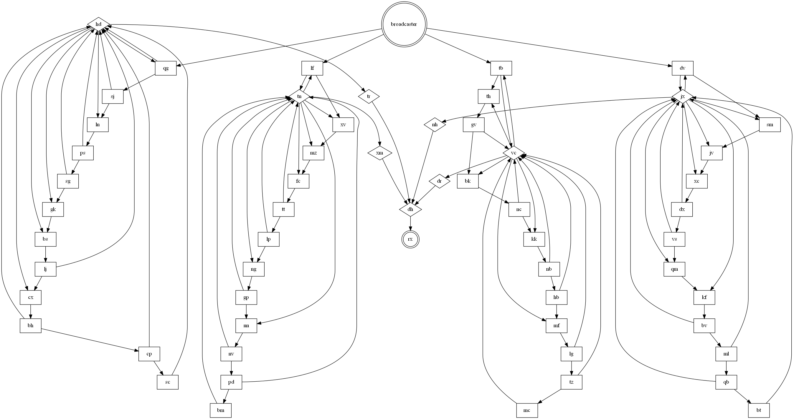

# Advent of Code 23

Solutions for the advent of code 2023 puzzles, implemented in Python. The
puzzles can be found here: https://adventofcode.com/2023

## How To

Run a module (stand in the root folder):
```
python -m adventofcode.day1.1
```

Run static code analysis (stand in the root folder):
```
black adventofcode
pylint adventofcode
flake8 adventofcode

```

## Notes

Make sure to always inspect the data! Many of the problems this year are extremely difficult to
solve unless certain properties of the input data are used. For some problems the data has been
very nice in the sense that assumptions that might seem unreasonable actually holds.

## Algorithms

### Lagrange Polynomial

A set of points can be used to create a polynomial function of degree <= #points, that
interpolates the points. This can be useful for problems with many "steps", if you can find a
pattern where the output increases e.g. quadratically for each step (or at least suspect that is
the case). The Lagrange polynomial can then be used to find the quadratic function from the first
few steps and then be used to compute the output size for the wanted number of steps. See day 21.

### Equation Solving

Z3 (Z3 Theorem Prover) it a powerful tool that can be used to solve complex equations. An
alternative is SymPy. Gaussian elimination can be used to solve systems of linear equations. See
day 24.

### Dynamic Programming

Dynamic programming is basically memoization. If a certain state occurs several times we can cache
the result and instantly get the result instead of computing it multiple times. The import part is
to find what the state is and what to include, if the state space is too large DP might not be
feasible. It is also important that we actually encounters the same state several times for DP to
have an affect. See day 12 for an example.

### Backtracking

Backtracking incrementally builds the solution and abandons a certain part as soon as it doesn't
fulfill the constraints. See day 12 for an example where the current path is abandon as soon as the
solution does not follow the rules. Another example is `longest_path()` from day 23.

### Intervals/Ranges

Instead of processing each element one by one try to find a group that is processed in the equally.
Then it is possible to process an entire group, which could lead to big speed ups in case of many
objects. It might also be beneficial to define a range as `[start, end[`, as e.g.
`len(range) = b - a` and `[a, b[ + [c, d[ = [a, c[`. See day 5.

### Hamming Distance

The number of different elements in two sequences (e.g. binary numbers).

### Cycle Detection

For some problems that needs to run for many iteration it might be possible to detect a cycle
(e.g. by keeping track of the current state via a set). Then all iterations can efficiently be run
by ignoring all cycles and only run the part before the cycle is entered and the number of steps
remaining after the cycle to fit the exact number of iterations. See day 14.

```
def f(steps):
    states = {}
    t = 0
    while t < steps:
        t += 1
        do_stuff()
        state = get_state()
        if state in states:
            cycle_length = t - states[state]
            num_cycles = (steps - t) // cycle_length
            t += num_cycles * cycle_length
        else:
            states[state] = t
```

### Shortest Path (Dijkstra)

See day 17.

```
def dijkstra(graph, start, neighbor_generator):
    queue = [(0, start)]
    costs = {}
    while queue:
        cost, node = heapq.heappop(queue)
        if node in costs:
            continue
        costs[node] = cost
        for n, c in neighbor_generator(graph, node):
            heapq.heappush(queue, (cost + c, n))
    return costs
```

### Longest Path

Deep-first search (DFS) can be used to find the longest path in a graph. Note however that this is
only feasible for very small graphs. It might be possible to compress large graphs to a smaller
representation, e.g. nodes that are only connected to two other nodes might be possible to collapse
to a single node. See day 23.

### Graph Cut

The Karger's_algorithm can be used to find a minimum cut of a graph. Another alternative that I
came up with is to flood fill from each node to all other nodes and count the number of times each
edge are used. The max used edges are probably the min cut, then we can just iteratively remove the
most used edges. It is however probably not guaranteed to always find the actual min cut. NetworkX
is a Python library that can be used to process graphs. See day 25.

### Maze Compression

It is possible to represent mazes as graphs where each node represents an intersection and the
edges represents the distance between intersections. This is also known as edge contraction. See
day 23.

### Polygons

The Shoelace formula can be used to find the area of a polygon. To find the number of internal or
external points Pick's theorem can be used.
```
    A = i + b/2 - 1,
where
    A: area of the polygon,
    i: number of internal points in polygon,
    b: number of border points.
```
See day 18 and https://www.themathdoctors.org/polygon-coordinates-and-areas/ for more information.

### Inside/outside Detection

To detect if we are inside or outside a geometric figure (e.g. loop or rectangle) we can scan for
crossings and change the inside/outside state at each crossing. See `get_insides` in algorithms.

### Tetris

A Tetris game (falling bricks) can be efficiently simulated using a Z-buffer that keeps track of
what is the current max `z` height for each position. If we also keep track of the id of the brick
we can construct a graph representing the support of each brick. This in turn can then be used to
e.g. efficiently simulate which bricks would be affected if something happens to another brick
(e.g. removal). See day 22.

## Python

Watch out for extensive copying, especially `deepcopy` as that it really slow. However, be aware
that in some cases `deepcopy` is needed and will lead to hard to find bugs if not used.

Break out of nested loop:

```
for y in range(10):
    for x in range(10):
        if <condition>:
            break
    else:
        continue
    break
```

Flatten 2D list:
```
[e for row in array_2d for e in row]
```

Rotate 2D list clockwise:
```
list(map(list, zip(*grid[::-1]))
```

Assignment in list comprehension:
```
sum(x**2 for e in elements if (x := f(e)) is not None)
```

Delete from dict without KeyError for missing elements:
```
dictionary.pop(key, None)
```

Partial evaluation (see day 17):
```
import functools
new_f = functools.partial(f, arg1=10, arg2=20)
```

Set recursion limit (might be needed to avoid crashes for some recursive algorithms):
```
import sys
sys.setrecursionlimit(15000)
```

## Regexp

Find overlapping matches:
```
import regex
regex.findall(pattern, text, overlapped=True)]
```
Note that there is (syntax) support for this in the ordinary re module but not as convenient.


## Graphviz

Graphs can be really helpful for visualizing problems. To generate a graph use the following command:

```
 dot -Tpng -o graph.png graph.dot
```
Look at day 20 to see how to generate the .dot file. Use `digraph` for directed graphs and `graph`
for undirected. To remove multiple equal connections use the `strict` keyword.


